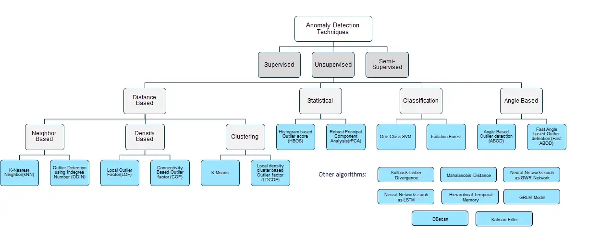
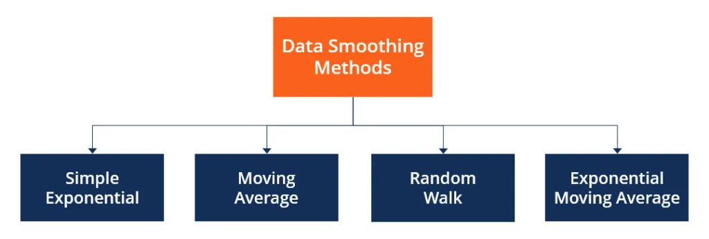

# ML Algorithms

## Supervised Learning

### Tree Based

1. Decision Tree : Decision Tree models make decision rules on the features to produce predictions. It can be used for classification or regression
    1. Applications
        1. Customer churn prediction
        2. Credit score modeling
        3. Disease prediction
    2. Advantages
        1. Explainable and interpretable
        2. Can handle missing values
    3. Disadvantages
        1. Prone to overfitting
        2. Sensitive to outliers
    4. Types
        1. Information Gain / Entropy
            1. ID3
            2. c4.5
            3. C5
            4. J48
        2. Gini Index
            1. SPRINT
            2. SLIQ

2. Random Forest : An ensemble learning method that combines the output of multiple decision trees
    1. Applications
        1. Credit score modeling
        2. Credicting housing prices
    2. Advantages
        1. Reduces overfitting
        2. Higher accuracy compared to other model
    3. Disadvantages
        1. Training complexity can be high
        2. Not very interpretable

3. Gradient Boosting Regression : Gradient Boosting Regression employs boosting to make predictive models from an ensemble of weak predictive learners
    1. Applications
        1. redicting car emission
        2. redicting ride hailing fare amount
    2. Advantages
        1. Better accuracy compared to other regression models
        2. It can handle multicollinearity
        3. It can handle nonllinear relationships
    3. Disadvantages
        1. Sensitive to outliers and can therefore cause overfitting
        2. Computationally expensive and has high complexity
4. XGBoost : Gradient Boosting algorithm that is eOcient & flexible. Can be used for both classification and regression tasks
    1. Applications
        1. Churn prediction
        2. Claims processing in insurance
    2. Advantages
        1. Provides accurate result
        2. Captures non linear relationships
    3. Disadvantages
        1. Hyperparameter tuning can be complex
        2. Does not perform well on sparse datasets
5. LightGBM Regression : A gradient boosting framework that is designed to be more effcient than other implementations
    1. Applications
        1. Predicting flight time for airlines
        2. Predicting cholesterol levels based on health data
    2. Advantages
        1. Can handle large amounts of data
        2. Computational eOcient & fast training speed
        3. Low memory usage
    3. Disadvantages
        1. Can overfit due to leaflwise splitting and high sensitivity
        2. Hyperparameter tuning can be comple

### Linear Models

1. Linear Regression :A simple algorithm that models a linear relationship between inputs and a continuous numerical output variable |(multiple linear regression) targets predictive value finds out relationship between variable and forcasting
    1. Applications
        1. Stock price prediction
        2. Predicting housing prices
        3. Predicting customer lifetime value
    2. Advantages
        1. Explainable method
        2. Interpretable results by its output coeficiants
        3. Faster to train than other machine learning model
    3. Disadvantages
        1. Assumes linearity between inputs and output
        2. Sensitive to outlier8
        3. Can underfit with small, high dimensional data

2. Logistic Regression : A simple algorithm that models a linear relationship between inputs and a categorical output (1 or 0)
    1. Applications
        1. Credit risk score predictioI
        2. Customer churn prediction
    2. Advantages
        1. Interpretable and explainable
        2. Less prone to overfitting when using regularization
        3. Applicable for multilclass prediction
    3. Disadvantages
        1. Assumes linearity between inputs and outputs
        2. Can overfit with small, high-dimensional data

3. Ridge Regression : Part of the regression family — it penalizes features that have low predictive outcomes by shrinking their coefficients closer to zero. Can be used for classification or regression
    1. Applications
        1. Predictive maintenance for automobiles
        2. Sales revenue prediction
    2. Advantages
        1. Less prone to overfitting
        2. Best suited where data suffer from multicollinearit
        3. Explainable & interpretable
    3. Disadvantages
        1. All the predictors are kept in the final mode
        2. Doesn t perform feature selection

4. Lasso Regression : Part of the regression family — it penalizes features that have low predictive outcomes by shrinking their coeOcients to zero. Can be used for classification or regression
    1. Applications
        1. Predicting housing prices
        2. Predicting clinical outcomes based on health data
    2. Advantages
        1. Less prone to overfitting
        2. Can handle highldimensional data
        3. No need for feature selection
    3. Disadvantages
        1. Can lead to poor interpretability as it can keep highly correlated variables

### Regression Only

1. Linear Regression : Linear Regression models a linear relationship between input variables and a continuous numerical output variable. The default loss function is the mean square error (MSE)
    1. Applications
    2. Advantages
        1. Fast training because there are few parameters.
        2. Interpretable/Explainable results by its output coefficients.
    3. Disadvantages
        1. Assumes a linear relationship between input and output variables
        2. Sensitive to outliers.
        3. Typically generaliRes worse than ridge or lasso regression
2. Polynomial regression : Polynomial Regression models nonlinear relationships between the dependent, and independent variable as the n-th degree polynomial.
    1. Applications
    2. Advantages
        1. Provides a good approximation of the relationship between the dependent and independent variables.
        2. Capable of fitting a wide range of curvature.
    3. Disadvantages
        1. Poor interpretability of the coefficients since the underlying variables can be highly correlated
        2. The model fit is nonlinear but the regression function is linear
        3. Prone to overfitting.
3. Support vector Regression : Support Vector Regression (SVR) uses the same principle as SVMs but optimiRes the cost function to fit the most straight line (or plane) through the data points. With the kernel trick it can efficiently perform a non-linear regression by implicitly mapping their inputs into high-dimensional feature spaces.
    1. Applications
    2. Advantages
        1. Robust against outliers.
        2. Effective learning and strong generaliRation performance.
        3. Different Kernel functions can be specified for the decision function.
    3. Disadvantages
        1. Does not perform well with large datasets
        2. Tends to underfit in cases where the number of variables is much smaller than the number of observations
4. Gausian Process Regression : Gaussian Process Regression (GPR) uses a Bayesian approach that infers a probability distribution over the possible functions that fit the data. The Gaussian process is a prior that is specified as a multivariate Gaussian distribution
    1. Applications
    2. Advantages
        1. Provides uncertainty measures on the predictions.
        2. It is a flexible and usable non-linear model which fits many datasets well.
        3. Performs well on small datasets as the GP kernel allows to specify a prior on the function space.
    3. Disadvantages
        1. Poor choice of kernel can make convergence slow
        2. Specifying specific kernels requires deep mathematical understanding
5. Robust Regression : Robust Regression is an alternative to least squares regression when data is contaminated with outliers. The term “robust” refers to the statistical capability to provide useful information even in the face of outliers.
    1. Applications
    2. Advantages
        1. Designed to overcome some limitations of traditional parametric and non-parametric methods.
        2. Provides better regression coefficient over classical regression methods when outliers are present.
    3. Disadvantages
        1. More computationally intensive compared to classical regression methods
        2. It is not a cure-all for all violations, such as imbalanced data, poor quality data
        3. If no outliers are present in the data, it may not provide better results than classical regression methods

### Both regression / classification models

1. Decision Trees : Decision Tree models learn on the data by making decision rules on the variables to separate the classes in a flowchart like a tree data structure. They can be used for both regression and classification.
    1. Applications
    2. Advantages
        1. Explainable and interpretable
        2. Can handle missing values
    3. Disadvantages
        1. /@ Prone to overfitting
        2. Can be unstable with minor data drift
        3. Sensitive to outliers.
2. Random Forest : Random Forest classification models learn using an ensemble of decision trees. The output of the random forest is based on a majority vote of the different decision trees
    1. Applications
    2. Advantages
        1. Effective learning and better generaliRation performance
        2. Can handle moderately large datasets
        3. Less prone to overfit than decision trees
    3. Disadvantages
        1. Large number of trees can slow down performance
        2. Predictions are sensitive to outliers
        3. Hyperparameter tuning can be complex
3. Gradient Boosting : An ensemble learning method where weak predictive learners are combined to improve accuracy. Popular techniques include XGBoost, LightGBM and more.
    1. Applications
    2. Advantages
        1. Handling of multicollinearity
        2. Handling of non-linear relationships
        3. Effective learning and strong generaliRation performance.
        4. XGBoost is fast and is often used as a benchmark algorithm.
    3. Disadvantages
        1. Sensitive to outliers and can therefore cause overfitting
        2. High complexity due to hyperparameter tuning
        3. Computationally expensive
4. Ridge Regression : Ridge Regression penaliRes variables with low predictive outcomes by shrinking their coefficients towards Rero. It can be used for classification and regression.
    1. Applications
    2. Advantages
        1. Less prone to overfitting
        2. Best suited when data suffers from multicollinearity
        3. Explainable & Interpretable
    3. Disadvantages
        1. All the predictors are kept in the final model
        2. Doesnt perform feature selection
5. Lasso Regression : Lasso Regression penaliRes features that have low predictive outcomes by shrinking their coefficients to Rero. It can be used for classification and regression.
    1. Applications
    2. Advantages
        1. Good generaliRation performance
        2. Good at handling datasets where the number of variables is much larger than the number of observations
        3. No need for feature selection
    3. Disadvantages
        1. Poor interpretability/explainability as it can keep a single variable.from a set of highly correlated variables
6. AdaBoost :Adaptive Boosting uses an ensemble of weak learners that is combined into a weighted sum that represents the final output of the boosted classifier.
    1. Advantages
        1. Explainable & Interpretable
        2. Less need for tweaking parameters
        3. Usually outperforms Random Forest

    2. Disadvantages
        1. Less prone to overfitting as the input variables are not jointly optimized
        2. Sensitive to noisy data and outliers.

### Classification

1. SVM : (Classification + Regression) In its simplest form, support vector machine is a linear classifier. But with the kernel trick, it can efficiently perform a non-linear classification by implicitly mapping their inputs into high-dimensional feature spaces. This makes SVM one of the best prediction methods. | Application: Face detection, image classification, text categorization
    1. Applications
    2. Advantages
        1. Effective in cases with a high number of variables
        2. Number of variables can be larger than the number of samples
        3. Different Kernel functions can be specified for the decision function.
    3. Disadvantages
        1. Sensitive to overfitting, regulariRation is crucial
        2. Choosing a “good” kernel function can be difficult
        3. Computationally expensive for big data due to high training complexity
        4. Performs poorly if the data is noisy (target classes overlap)
2. Nearest Neighbors : Nearest Neighbors predicts the label based on a predefined number of samples closest in distance to the new point.
    1. Applications
    2. Advantages
        1. Successful in situations where the decision boundary is irregular
        2. Non-parametric approach as it does not make any assumption on the underlying data
    3. Disadvantages
        1. Sensitive to noisy and missing data
        2. Computationally expensive because the entire set of n points for every execution is required.

3. Logistic Regresssion (& its extensions) : The logistic regression models a linear relationship between input variables and the response variable. It models the output as binary values (0 or 1) rather than numeric values.
    1. Applications
    2. Advantages
        1. Explainable & Interpretable.
        2. Less prone to overfitting using regulariRation.
        3. Applicable for multi-class predictions
    3. Disadvantages
        1. Makes a strong assumption about the relationship between input and response variables.
        2. Multicollinearity can cause the model to easily overfit without regulariRation

4. Linear Descriminent Analysis : The linear decision boundary maximiRes the separability between the classes by finding a linear combination of features

    1. Linear discriminant analysis (LDA) is a technique used to find a linear combination of features that separates different classes of a data set as well as possible. It is a supervised technique, meaning it requires labeled data. It is commonly used as a dimensionality reduction technique and a classifier. LDA is a method used for finding a linear combination of features that separates different classes of a data set as well as possible.
    2. The goal of LDA is to project the original features onto a new feature space with a lower dimensionality while retaining as much of the class discrimination information as possible. LDA finds the linear combination of features that maximizes the ratio of the between-class variance to the within-class variance. In other words, it finds the feature space that separates the classes as much as possible while keeping the data points within each class as close together as possible.
    3. LDA works better than pca when training data is well representative of data in system
    4. If data isnt presentative enough pca works better
         1. Applications
         2. Advantages
            1. Explainable & Interpretable.
            2. Applicable for multi-class predictions.
         3. Disadvantages
             1. Multicollinearity can cause the model to overfit
             2. Assuming that all classes share the same covariance matrix.
             3. Sensitive to outliers.
             4. Doesnt work well with small class sizes
5. Naive bayes

    1. Gaussian Naive bayes
    2. Naive bayes
    3. Bernoulli Naïve Bayes

## Unsupervised Learning

### Association

1. Apriori :Rule based approach that identifies the most frequent itemset in a given dataset where prior knowledge of frequent itemset properties is used.The Apriori algorithm uses the join and prune step iteratively to identify the most frequent itemset in the given dataset. Prior knowledge (apriori) of frequent itemset properties is used in the process..uses frequent datasets to generate association rules.It is designed to work on databases that contain transactions.It uses a breadth - first search and hash tree to calculate the itemset efficiently.Apriori Algorithm = uses frequent datasets to generate association rule.It is designed to work on databases that contain transactions.we use mlxtend to implement apriori.`mlxtend.preprocessing import TransactionEncoder`
    1. Applications
        1. Product placements
        2. Recommendation engines
        3. Promotion optimization
    2. Advantages
        1. Results are intuitive and Interpretable
        2. Exhaustive approach as it finds all rules
        3. based on the confidence and support
        4. Explainable & interpretable results.
        5. Exhaustive approach based on the confidence and support
    3. Disadvantages
        1. Generates many uninteresting itemsets
        2. Computationally and memory intensive.
        3. Results in many overlapping item sets
        4. Requires defining the expected number of clusters or mixture components in advance
        5. The covariance type needs to be defined for the mixture of component

2. FP_Growth algorithm :Frequent Pattern growth (FP-growth) is an improvement on the Apriori algorithm for finding frequent itemsets. It generates a conditional FP-Tree for every item in the data
    1. Applications
    2. Advantages
        1. Explainable & interpretable results.
        2. Smaller memory footprint than the Apriori algorithm
    3. Disadvantages
        1. More complex algorithm to build than Apriori
        2. Can result in many (incremental) overlapping/trivial itemsets
3. FP-Max Algorithm :A variant of Frequent pattern growth that is focused on finding maximal itemsets
    1. Applications
    2. Advantages
        1. Explainable & Interpretable results.
        2. Smaller memory footprint than the Apriori and FP-growth algorithms
    3. Disadvantages
        1. More complex algorithm to build than Apriori
4. Eclat :Equivalence Class Clustering and Bottom-Up Lattice Traversal (Eclat) applies a Depth First Search of a graph procedure. This is a more efficient and scalable version of the Apriori algorithm.
    1. Applications
    2. Advantages
        1. Explainable & interpretable results.
        2. Computational faster compared to the Apriori algorith
    3. Disadvantages
        1. Can provide only a subset of results in contrast to the Apriori algorithm and its variants
5. Hypergeometric Networks : HNet learns the Association from datasets with mixed data types (discrete and continuous variables) and with unknown functions. Associations are statistically tested using the hypergeometric distribution for finding frequent itemset.
    1. Applications
    2. Advantages
        1. Explainable & Interpretable results
        2. More robust against spurious associations as it uses statistical inferences
        3. Can associate discrete (itemsets) in combination with continuous measurements
        4. Can handle missing values
    3. Disadvantages
        1. Computationally intensive for very large datasets.

#### Applications for Association Rule learning

1. Market Basket Analysis = big retailers
2. Medical diagnosis
3. Protein Sequence

### Clustering

1. K-Means :KMeans is the most widely used clustering approach—it determines K clusters based on euclidean distances Most common clustering approach which assumes that the closer data points are to each other, the more similar they are. It determines K clusters based on Euclidean distances.
    1. Applications
        1. Customer segmentatioI
        2. Recommendation systems
    2. Advantages
        1. Scales to large datasets
        2. Simple to implement and interpret
        3. Results in tight cluster
        4. Interpretable & explainable results
    3. Disadvantages
        1. Requires the expected number of clusters from the beginning
        2. Has troubles with varying cluster sizes and densities
        3. Not suitable to identify clusters with non-convex shapes.
2. Hierarchical clustering : A bottomlup approach where each data point is treated as its own cluster—and then the closest two clusters are merged together iteratively
    1. Applications
        1. Fraud detection
        2. Document clustering based on similarity
    2. Advantages
        1. There is no need to specify the number of clusters
        2. The resulting dendrogram is informative
    3. Disadvantages
        1. Doesnt always result in the best clustering
        2. Not suitable for large datasets due to high complexity
3. Gausian Mixture : A bottomlup approach where each data point is treated as its own cluster—and then the closest two clusters are merged together iteratively
    1. Applications
        1. Customer segmentation
        2. Recommendation systems
    2. Advantages
        1. Computes a probability for an observation belonging to a cluster
        2. Can identify overlapping clusters
        3. More accurate results compared to Klmeans
    3. Disadvantages
        1. Requires complex tuning
        2. Requires setting the number of expected mixture components or clusters
4. DBSCAN : Density-Based Spatial Clustering of Applications with Noise can handle non-linear cluster structures, purely based on density. It can differentiate and separate regions with varying degrees of density, thereby creating clusters.
    1. Applications
    2. Advantages
        1. No assumption on the expected number of clusters.
        2. Can handle noisy data and outliers
        3. No assumptions on the shapes and sizes of the clusters
        4. Can identify clusters with different densities
    3. Disadvantages
        1. Requires optimization of two parameters
        2. Can struggle in case of very high dimensional data
5. HDBSCAN : Family of the density-based algorithms and has roughly two steps: finding the core distance of each point, and expands clusters from them. It extends DBSCAN by converting it into a hierarchical clustering algorithm
    1. Applications
    2. Advantages
        1. No assumption on the expected number of clusters
        2. Can handle noisy data and outliers.
        3. No assumptions on the shapes and sizes of the clusters.
        4. Can identify clusters with different densities
    3. Disadvantages
        1. Mapping of unseen objects in HDBSCAN is not straightforward.
        2. Can be computationally expensive
6. Agglomerative Hierarchical Clustering :Uses hierarchical clustering to determine the distance between samples based on the metric, and pairs are merged into clusters using the linkage type.
    1. Applications
    2. Advantages
        1. There is no need to specify the number of clusters.
        2. With the right linkage, it can be used for the detection of outliers.
        3. Interpretable results using dendrograms.
    3. Disadvantages
        1. Specifying metric and linkages types requires good understanding of the statistical properties of the data
        2. Not straightforward to optimize
        3. Can be computationally expensive for large dataset
7. OPTICS : Family of the density-based algorithms where it finds core sample of high density and expands clusters from them. It operates with a core distance (ɛ) and reachability distance
    1. Applications
    2. Advantages
        1. No assumption on the expected number of clusters.
        2. Can handle noisy data and outliers.
        3. No assumptions on the shapes and sizes of the clusters.
        4. Can identify clusters with different densities.
        5. Not required to define a fixed radius as in DBSCAN.
    3. Disadvantages
        1. It only produces a cluster ordering.
        2. Does not work well in case of very high dimensional data.
        3. Slower than DBSCAN.
8. Gausian Mixture Models :Gaussian Mixture Models (GMM) leverages probabilistic models to detect clusters using a mixture of normal (gaussian) distributions.
    1. Applications
    2. Advantages
        1. Provides uncertainty measures for each observation
        2. Can identify overlapping clusters
    3. Disadvantages
        1. Requires defining the expected number of clusters or mixture components in advance
        2. The covariance type needs to be defined for the mixture of components

### Dimensionality Reduction

1. PCA :Principal Component Analysis (PCA) is a feature extraction approach that uses a linear function to reduce dimensionality in datasets by minimizing information loss.
    1. can be used for facial recognition
    2. It is a linear transformmation
    3. most popular feature extraqction method
    4. consisits of transformation from space of hign dim to another with more reduced dim
    5. If data is highly corelated there is redundant information
    6. so pca decreases amount of redundant information by decorrelating input vectors
    7. input vectors with high dimentions & correlated can be represented in lower dimention space & decorrelated
    8. PCA is powerful tool to compress data
    9. Principal component analysis (PCA) is a technique used to reduce the dimensionality of a data set while retaining as much of the variation present in the data as possible. It does this by transforming the data to a new coordinate system such that the first axis (called the first principal component) explains the greatest amount of variance in the data, the second axis (second principal component) explains the second greatest amount of variance, and so on. These new axes are called principal components, and the data can be projected onto them to create a lower-dimensional representation of the data. PCA is often used as a tool in exploratory data analysis and for making data easy to visualize.
        1. Applications
        2. Advantages
            1. Explainable & Interpretable results.
            2. New unseen datapoints can be mapped into the existing PCA space.
            3. Can be used as a dimensionality reduction technique as a preliminary step to other machine learning tasks
            4. Helps reduce overfitting
            5. Helps remove correlated features
        3. Disadvantages
            1. Sensitive to outliers
            2. Requires data standardization

2. t-SNE :t-distributed Stochastic Neighbor Embedding is a non-linear dimensionality reduction method that converts similarities between data points to joint probabilities using the Student t-distribution in the low-dimensional space
    1. Applications
    2. Advantages
        1. Helps preserve the relationships seen in high dimensionality
        2. Easy to visualise the structure of high dimensional data in 2 or 3 dimensions
        3. Very effective for visualizing clusters or groups of data points and their relative proximities
    3. Disadvantages
        1. The cost function is not convex; different initializations can get different results.
        2. Computationally intensive for large datasets.
        3. Default parameters do not always achieve the best results
3. UMAP :Uniform Manifold Approximation and Projection (UMAP) constructs a high-dimensional graph representation of the data then optimizes a low-dimensional graph to be as structurally similar as possible.
    1. Applications
    2. Advantages
        1. It can be used as a general-purpose dimension reduction technique as a preliminary step to other machine learning tasks.
        2. Can be very effective for visualizing clusters or groups of data points and their relative proximities.
        3. Able to handle high dimensional sparse datasets
    3. Disadvantages
        1. Default parameters do not always achieve the best results
4. ICA :Independent Component Analysis (ICA) is a linear dimensionality reduction method that aims to separate a multivariate signal into additive subcomponents under the assumption that independent components are non-gaussian. Where PCA compresses the data, ICA separates the information
    1. Applications
    2. Advantages
        1. Can separate multivariate signals into its subcomponents.
        2. Clear aim of the method; only applicable if there are multiple independent generators of information to uncover.
        3. Can extract hidden factors in the data by transforming a set of variables to a new set that is maximally independent.
    3. Disadvantages
        1. Without any prior knowledge, determination of the number of independent components or sources can be difficult.
        2. PCA is often required as a pre-processing step.
5. PaCMAP :Pairwise Controlled Manifold Approximation (PaCMAP) is a dimensionality reduction method that optimizes low-dimensional embeddings using three kinds of point pairs: neighbor pairs, mid-near pair, and further pairs
    1. Applications
    2. Advantages
        1. It can preserve both local and global structure of the data in original space.
        2. Performance is relatively robust within reasonable parameter choices.
    3. Disadvantages
        1. Parameters have been tuned on smaller datasets and it is yet unknown how it behaves and extends to very high-dimensional datasets

## Reinforcement Learning

## Ensemble Learning

seeks better predictive performance by combining the predictions from multiple Macine learning  models

### Boosting

Boosting involves adding ensemble members sequentially that correct the predictions made by prior models and outputs a weighted
avg of the predictions

1. ada boost
2. XGBoost
3. Stochastic Gradient Boosting

### Bayesian model averaging

### Bayesian model combination

### Bucket of models

### Stacking

Stacking involves fitting many different model types on the same data and using another model to learn how to best combine the predictions

### Bagging

Bagging involves fitting many decision trees on different samples of the samedataset and averaging the predictions

1. Bagging classifier
2. Random forest
3. Extra trees
4. baggged decision trees

### Voting

 Building multiple models (typically of differing types) and simple statistics (like calculating the mean) are used to combine predictions.

1. Hard voting
2. soft voting

### Blending

## Nural Networks

1. Convolution nural networks
2. Recurrent nural networks
3. Artificial Nural Networks
4. Layer Nural network

## NLP

1. Algorithmia provides a free API endpoint for many algorithms
2. NLTK (Natural Language toolkit) a Python library that provides modules for processing text, classifying, tokenizing, tagging, parsing, and more
3. Stanford NLP :  a suite of NLP tools that provide part-of-speech tagging, the named entity recognizer, coreference resolution system, sentiment analysis, and more.
4. Google SyntaxNet a neural-network framework for analyzing and understanding the grammatical structure of sentences.
5. BERT : Bidirectional Encoder Representations from Transformers (BERT) is a transformer-based machine learning technique for natural language processing (NLP) pre-training developed by Google
6. SPACY : free open-source library for Natural Language Processing in Python. It features NER, POS tagging, dependency parsing, word vectors and more

## HyperParameters / Tune Parameters

The parameters which can affect your output

1. regularization
2. Gamma
3. Kernal

## F1

**f1-score** is the weighted harmonic mean of precision and recall. The best possible **f1-score** would be 1.0 and the worst would be 0.0.  **f1-score** is the harmonic mean of precision and recall. So, **f1-score** is always lower than accuracy measures as they embed precision and recall into their computation. The weighted average of `f1-score` should be used to compare classifier models, not global accuracy.

## Encoding

### Manual Encoder

1. Label encoder
2. One Hot Encoder

### Auto Encoders

In detection of images  we use Auto encoders

## Decoding

unsupervised deep learning algorithms

1. deep auto encoders
2. stacked Auto encoders

## fitting

1. overfitting
2. underfitting

## Anamoly detection (outlier detection)

### Supervised Anamoly detection (needs training of data)

1. KNN
2. Bayesian network

### Semi-supervised anomaly detection

### Unsupervised Anamoly detection (Doesnt requires training data)

## Deep Learning

### YOLO-v3

you only look once
uses opencv

## NMF

NMF: Non-Negative Matrix Factorization
m x n calculation in matrices

## Binary classifier

it uses confusion matrix & supervised learning algorithm for that

    Support Vector Machines
    Naive Bayes
    Nearest Neighbor
    Decision Trees
    Logistic Regression
    Neural Networks

    few binary classification applications, where the 0 and 1 columns are two possible classes for each observation:

    1.    Application -> Observation -> 0 1
    2.    Medical Diagnosis -> Patient -> Healthy -> Diseased
    3.    Email Analysis -> Email -> Not Spam -> Spam
    4.    Financial Data Analysis -> Transaction -> Not Fraud -> Fraud
    5.    Marketing -> Website visitor -> Won't Buy -> Will Buy
    6.    Image Classification -> Image -> Hotdog -> Not Hotdog

    https://towardsdatascience.com/top-10-binary-classification-algorithms-a-beginners-guide-feeacbd7a3e2

## Multiclass classifier

In the case of identification of different types of fruits, “Shape”, “Color”, “Radius” can be featured, and “Apple”, “Orange”, “Banana” can be different class labels.

supervised learning technique
we can check accuracy

Approach –  

1. Load dataset from the source.
2. Split the dataset into “training” and “test” data.
3. Train Decision tree, SVM, and KNN classifiers on the training data.
4. Use the above classifiers to predict labels for the test data.
5. Measure accuracy and visualize classification.

## smoothing methods

used to reduce effect of Variation/Veriance on dataset
used in forcasting techniques
Data smoothing refers to a statistical approach of eliminating outliers from datasets to make the patterns more noticeable. It is achieved using algorithms to eliminate statistical noise from datasets. The use of data smoothing can help forecast patterns, such as those seen in share prices.

1. moving_avarage_smoothing
2. exponential_smoothing
3. double_exponential_smoothing
4. triple_exponential_smoothing
and many more
